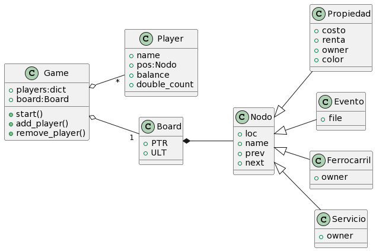

Version 0.5 of the laboratory 3, made in Python. By David Hernandez, María Solá, Juan Aragón, Kenny Zhu 

## Roadmap
- [X] Archivos de casillas, cofre y arca
- [X]  Terminar casillas.txt
- [X]  Implementar generador de tablero
- [X] Añadir Clase Player
- [X] Añadir Clase Game
- [X] Implementar code_to_run
- [] Diseño Visual del tablero
- [] Reorganizar nombres
 
## Minimum requirements
- [X] Add class diagram
- [X] Use linked lists for property data
- [X] Add name, cost and rent to the property data
- [X] Add player object with needed attributes
- [X] Add multiplayer (at least 2 to 4 players)
- [X] Add dice rolling
- [X] Use files to save community chest and chance cards
- [X] Implement community chest and chance cards
- [X] Implement property selling
- [X] Implement rent payments
- [] Implement 8 currencies
- [] Other stuff

## Diagrama UML
