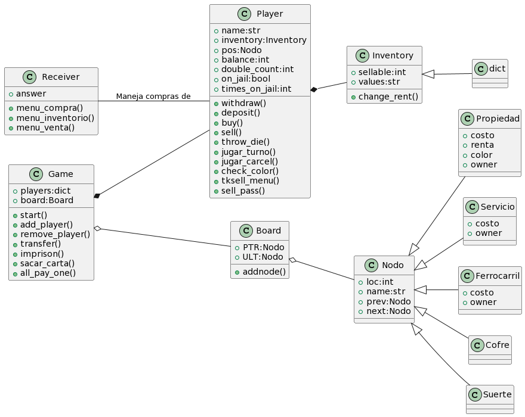

Version 0.85 of the laboratory 3, made in Python.

**By TIME LORDS**:watch:: David Hernandez, María Solá, Juan Aragón, Kenny Zhu 

## Roadmap
- [X] Archivos de casillas, cofre y arca
- [X] Terminar casillas.txt
- [X] Implementar generador de tablero
- [X] Añadir Clase Player
- [X] Añadir Clase Game
- [X] Diseñar lógica
- [X] Implementar code_to_run
- [X] Diseño Visual del tablero
- [X] Reorganizar nombres
- [X] Agregar aumento de renta por colores
- [] Interfaz Gráfica
 
## Minimum requirements
- [X] Add class diagram
- [X] Use linked lists for property data
- [X] Add name, cost and rent to the property data
- [X] Add player object with needed attributes
- [X] Add multiplayer (at least 2 to 4 players)
- [X] Add dice rolling
- [X] Use files to save community chest and chance cards
- [X] Implement community chest and chance cards
- [X] Implement property selling
- [X] Implement rent payments
- [] Implement 8 currencies
- [X] Roll dice to set turns
## Aditional Functions
- [X] Railroads
- [X] Services
- [] Sound effects
- [X] Railroad,Service,Pass selling
- [X] Color improvement of rent

## Tablero

## Diagrama UML
